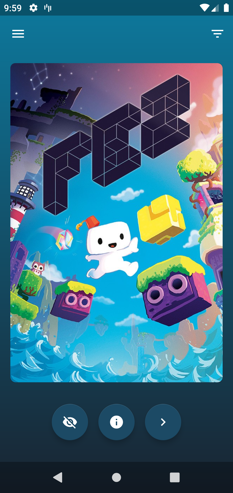

# Steam Shuffle

 

Android app to help you choose a game from your Steam library to play 

## Screenshots

 

## Download

## Libraries and tools

- Clean Architecture, MVVM (ViewModel, LiveData)
- Kotlin
- Kotlin Coroutines
- AndroidX
- Android KTX
- Material Components
- Recycler View Selection
- Paging Library
- Room
- OKHttp, Retrofit
- Moshi
- Glide
- Dagger
- Cicerone
- Stetho
- Leak Canary
- Crashlytics